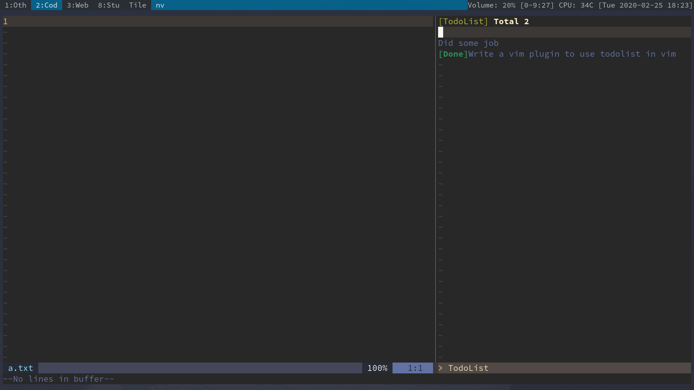

## LightTodo.vim

### ScreenShot



### Introduction

`LightTodo.vim` is a light todolist in (neo)vim.And it can connected with [todo](https://github.com/mattn/todo) to use.I think it'll be convenient.

### Installation

Using [vim-plug](https://github.com/junegunn/vim-plug) is the best way to install the plugin.You should insert:

```vim
Plug 'SpringHan/lightTodo.vim'
```

in your `.vimrc`(for vim) or `init.vim`(for neovim).

### Configuration

To use this plugin,you only need to set a path:

```vim
let g:LightTodoFile = '/path/to/file'
```

or

```vim
let g:LightTodoFile = $HOME.'file'
```

Note: The path must be a absolute path.

## License

MIT
